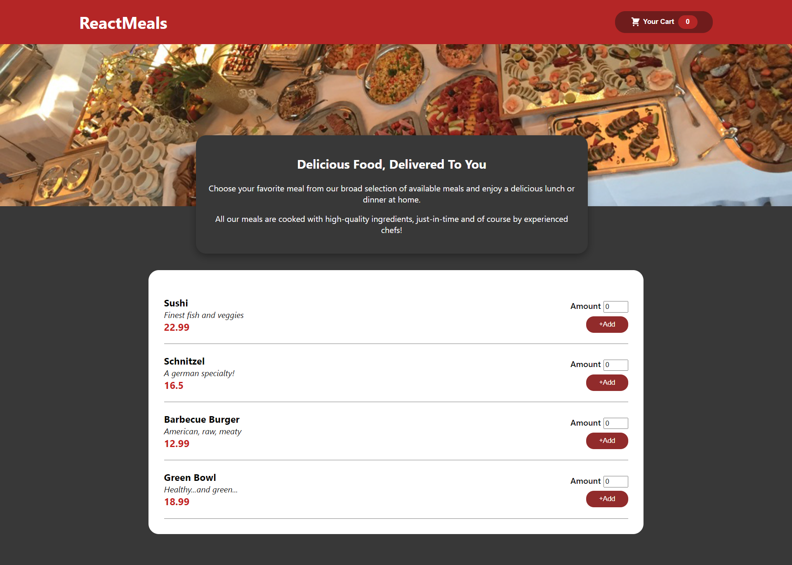

# food-order-app

a simple and functional food ordering app.

hosted link: [foodorderapp-yb.netlify.app](https://foodorderapp-yb.netlify.app/)

I made this food order app as a practice project while learning react hooks and context API. This app mainly uses a context and a reducer to manage the data. This project is still a work in progress and there are more functionalities to be added.



---

To run the project

open a terminal window

```
git clone https://github.com/yasinbhojani/food-order-app
```

```
cd food-order-app
```

download dependencies
```
npm install
```

run the project
```
npm start
```
---
## credits:
 - [Academind](https://github.com/academind)
 - [Maximilian Schwarzmüller](https://github.com/mschwarzmueller)
 - [React Course on Udemy](https://www.udemy.com/course/react-the-complete-guide-incl-redux/)
